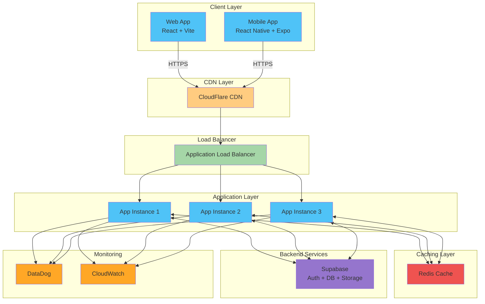
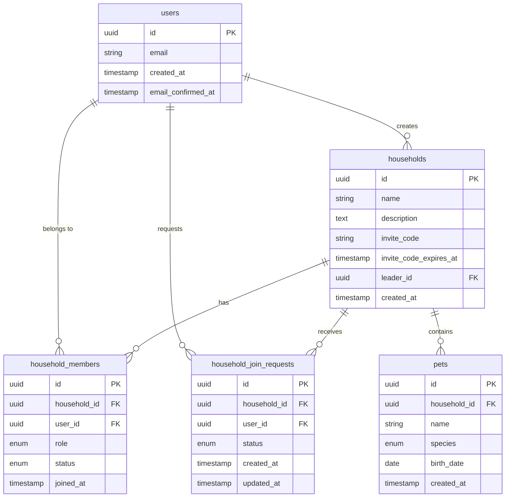
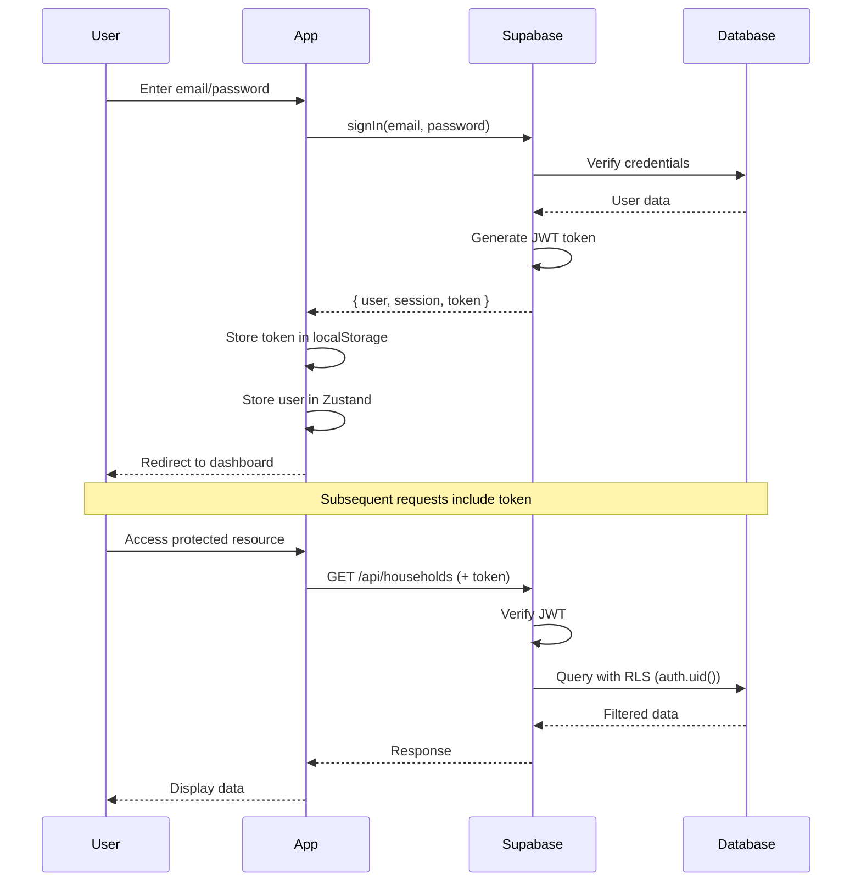
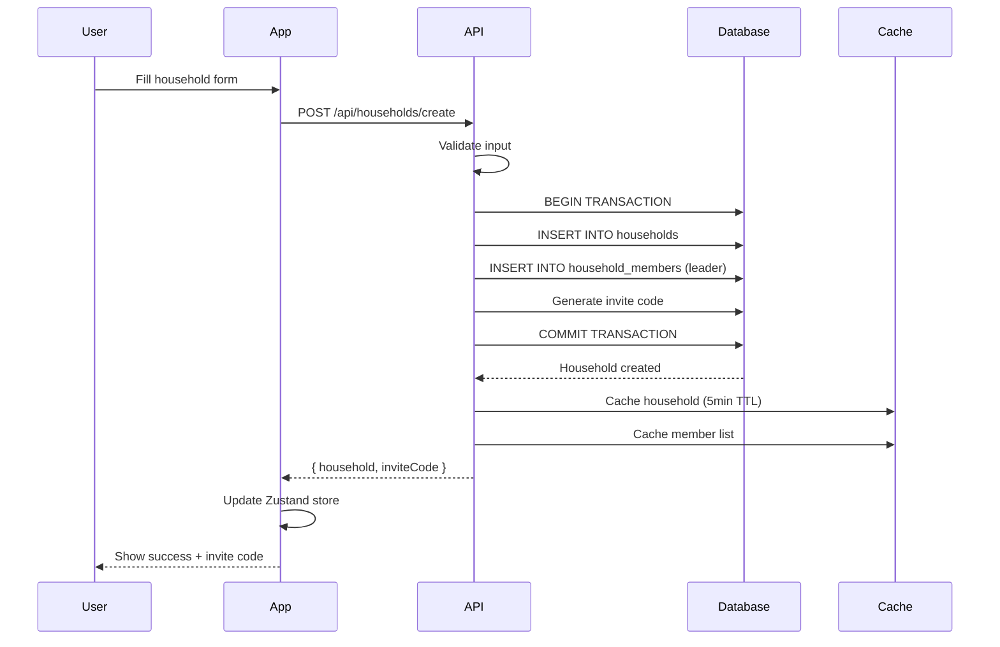
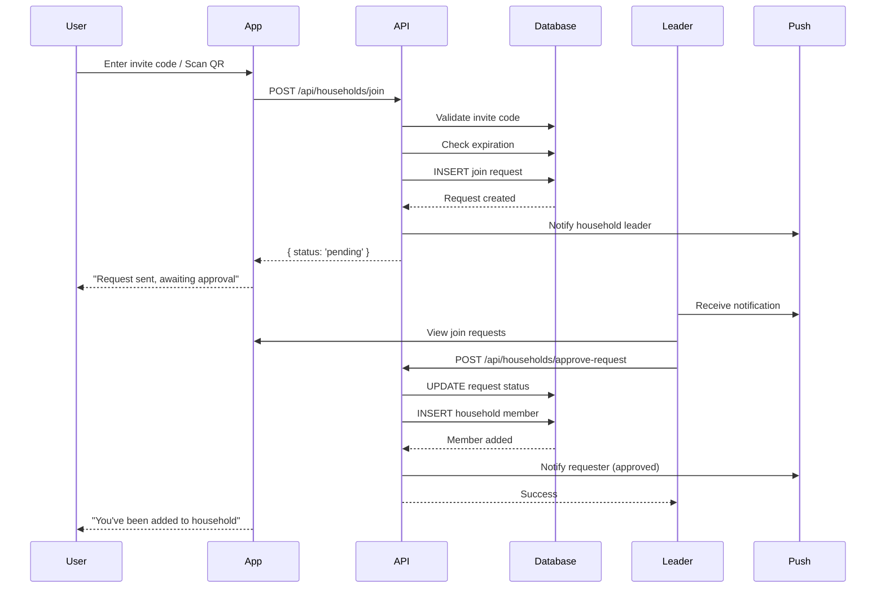

# PetForce Architecture

Comprehensive guide to PetForce's system architecture, design decisions, and technical implementation.

## Table of Contents

- [System Overview](#system-overview)
- [Architecture Principles](#architecture-principles)
- [High-Level Architecture](#high-level-architecture)
- [Frontend Architecture](#frontend-architecture)
- [Backend Architecture](#backend-architecture)
- [Database Design](#database-design)
- [Authentication Flow](#authentication-flow)
- [Household Management](#household-management)
- [State Management](#state-management)
- [Caching Strategy](#caching-strategy)
- [Security Architecture](#security-architecture)
- [Mobile Architecture](#mobile-architecture)
- [Infrastructure](#infrastructure)
- [Monitoring & Observability](#monitoring--observability)

---

## System Overview

PetForce is a monorepo-based pet care platform built with modern web and mobile technologies. It provides a seamless cross-platform experience for families to manage their pets' health and care.

### Technology Stack

**Frontend:**

- **Web**: React 18.2 + TypeScript 5.3 + Vite
- **Mobile**: React Native + Expo
- **Styling**: Tailwind CSS (web), React Native StyleSheet (mobile)
- **Routing**: React Router (web), React Navigation (mobile)

**Backend:**

- **BaaS**: Supabase (PostgreSQL + Authentication + Storage)
- **API Layer**: Edge Functions (Deno runtime)
- **Real-time**: Supabase Realtime (WebSockets)

**State Management:**

- Zustand (global state)
- React Query / SWR (server state)
- AsyncStorage (mobile persistence)

**Infrastructure:**

- **Deployment**: AWS ECS Fargate, Kubernetes
- **CDN**: CloudFlare
- **Monitoring**: DataDog, CloudWatch, Prometheus
- **CI/CD**: GitHub Actions

---

## Architecture Principles

### 1. Mobile-First

60-80% of users are on mobile devices. Mobile experience is prioritized:

- Offline-first data caching
- Touch-optimized interfaces (44pt minimum)
- Platform-specific optimizations
- Deep linking support
- Push notifications

### 2. Monorepo Structure

Benefits:

- Code sharing between web and mobile
- Atomic changes across platforms
- Single source of truth for types
- Simplified dependency management

```
PetForce/
├── apps/
│   ├── web/              # Web application
│   └── mobile/           # Mobile application
└── packages/
    ├── auth/             # Shared authentication logic
    ├── supabase/         # Supabase client
    └── ui/               # Shared UI components
```

### 3. Type Safety

- TypeScript everywhere
- Shared types between frontend and backend
- Database types generated from schema
- Runtime validation with Zod

### 4. Security by Default

- No sensitive data in logs (automatic PII redaction)
- Authentication required for all operations
- Row-level security in database
- Rate limiting on all APIs
- HTTPS only

### 5. Performance First

- Code splitting and lazy loading
- Image optimization
- Database query optimization
- Redis caching
- CDN for static assets

---

## High-Level Architecture



---

## Frontend Architecture

### Component Structure

```
src/
├── features/                # Feature-based organization
│   ├── auth/
│   │   ├── components/      # Feature-specific components
│   │   ├── pages/           # Route-level components
│   │   ├── hooks/           # Custom hooks
│   │   └── types/           # TypeScript types
│   └── households/
│       ├── components/
│       ├── pages/
│       ├── hooks/
│       └── types/
├── components/              # Shared components
│   ├── ui/                  # Generic UI components
│   └── layout/              # Layout components
├── hooks/                   # Shared hooks
├── utils/                   # Utility functions
├── api/                     # API client layer
├── stores/                  # Zustand stores
└── types/                   # Global TypeScript types
```

### Design Patterns

**1. Feature-Based Organization**

Organize by feature/domain rather than technical role:

```
✅ Good (Feature-based)
features/
├── auth/
│   ├── LoginForm.tsx
│   ├── useAuth.ts
│   └── auth-api.ts
└── households/
    ├── HouseholdCard.tsx
    ├── useHousehold.ts
    └── household-api.ts

❌ Bad (Role-based)
components/
├── LoginForm.tsx
└── HouseholdCard.tsx
hooks/
├── useAuth.ts
└── useHousehold.ts
api/
├── auth-api.ts
└── household-api.ts
```

**2. Custom Hooks for Logic**

Extract reusable logic into custom hooks:

```typescript
// hooks/useHousehold.ts
export function useHousehold(householdId: string) {
  const [household, setHousehold] = useState<Household | null>(null);
  const [loading, setLoading] = useState(true);
  const [error, setError] = useState<Error | null>(null);

  useEffect(() => {
    loadHousehold(householdId)
      .then(setHousehold)
      .catch(setError)
      .finally(() => setLoading(false));
  }, [householdId]);

  return { household, loading, error };
}
```

**3. Container/Presenter Pattern**

Separate data fetching from presentation:

```typescript
// Container (smart component)
export function HouseholdDashboard() {
  const { household, loading } = useHousehold();

  if (loading) return <Loading />;
  if (!household) return <NotFound />;

  return <HouseholdView household={household} />;
}

// Presenter (dumb component)
interface HouseholdViewProps {
  household: Household;
}

export function HouseholdView({ household }: HouseholdViewProps) {
  return (
    <div>
      <h1>{household.name}</h1>
      {/* Pure presentation logic */}
    </div>
  );
}
```

---

## Backend Architecture

### Supabase as Backend

We use Supabase as our Backend-as-a-Service (BaaS):

**Advantages:**

- Managed PostgreSQL database
- Built-in authentication
- Real-time subscriptions
- File storage
- Edge Functions (serverless)
- Automatic API generation
- Row-level security

**Services Used:**

1. **Database**: PostgreSQL 15
2. **Authentication**: Email, Magic Link, OAuth (Google, Apple)
3. **Storage**: File uploads for pet photos
4. **Realtime**: WebSocket subscriptions
5. **Edge Functions**: Custom business logic

### Database Design

See [Database Schema](#database-design) section for details.

### Edge Functions

Custom serverless functions for complex logic:

```
supabase/
└── functions/
    ├── create-household/        # Household creation
    ├── join-household/           # Join request handling
    ├── send-notification/        # Push notifications
    └── generate-analytics/       # Analytics computation
```

**Example Edge Function:**

```typescript
// supabase/functions/create-household/index.ts
import { serve } from "https://deno.land/std@0.168.0/http/server.ts";
import { createClient } from "https://esm.sh/@supabase/supabase-js@2";

serve(async (req) => {
  const supabase = createClient(
    Deno.env.get("SUPABASE_URL")!,
    Deno.env.get("SUPABASE_SERVICE_ROLE_KEY")!,
  );

  const { name, description } = await req.json();
  const authHeader = req.headers.get("Authorization")!;

  // Verify JWT token
  const {
    data: { user },
  } = await supabase.auth.getUser(authHeader.replace("Bearer ", ""));

  if (!user) {
    return new Response(JSON.stringify({ error: "Unauthorized" }), {
      status: 401,
    });
  }

  // Create household
  const { data: household, error } = await supabase
    .from("households")
    .insert({
      name,
      description,
      leader_id: user.id,
    })
    .select()
    .single();

  if (error) {
    return new Response(JSON.stringify({ error: error.message }), {
      status: 500,
    });
  }

  return new Response(JSON.stringify({ household }), {
    status: 201,
    headers: { "Content-Type": "application/json" },
  });
});
```

---

## Database Design

### Schema Overview

```sql
-- Core Tables
users                    # User accounts (Supabase Auth)
households               # Household entities
household_members        # Membership relationships
household_join_requests  # Join requests
pets                     # Pet profiles (future)
```

### Entity Relationship Diagram



### Row-Level Security (RLS)

All tables use RLS for data access control:

```sql
-- Example: household_members table
CREATE POLICY "Users can view their own household memberships"
ON household_members
FOR SELECT
USING (auth.uid() = user_id);

CREATE POLICY "Household leaders can manage members"
ON household_members
FOR ALL
USING (
  EXISTS (
    SELECT 1 FROM household_members hm
    WHERE hm.household_id = household_members.household_id
      AND hm.user_id = auth.uid()
      AND hm.role = 'leader'
  )
);
```

### Indexes

Performance-critical indexes:

```sql
-- Household lookups
CREATE INDEX idx_households_invite_code ON households(invite_code);
CREATE INDEX idx_households_leader_id ON households(leader_id);

-- Member lookups
CREATE INDEX idx_household_members_household_id ON household_members(household_id);
CREATE INDEX idx_household_members_user_id ON household_members(user_id);

-- Join request lookups
CREATE INDEX idx_join_requests_household_id ON household_join_requests(household_id);
CREATE INDEX idx_join_requests_user_id ON household_join_requests(user_id);
CREATE INDEX idx_join_requests_status ON household_join_requests(status);
```

---

## Authentication Flow



### Token Management

- **Access Token**: JWT, expires in 1 hour
- **Refresh Token**: Long-lived, expires in 30 days
- **Automatic Refresh**: SDK handles token refresh
- **Storage**: localStorage (web), SecureStore (mobile)

---

## Household Management

### Household Creation Flow



### Household Join Flow



---

## State Management

### Zustand Stores

We use Zustand for global state management:

```typescript
// stores/authStore.ts
interface AuthState {
  user: User | null;
  session: Session | null;
  loading: boolean;
  setUser: (user: User | null) => void;
  setSession: (session: Session | null) => void;
  logout: () => Promise<void>;
}

export const useAuthStore = create<AuthState>((set) => ({
  user: null,
  session: null,
  loading: true,
  setUser: (user) => set({ user }),
  setSession: (session) => set({ session }),
  logout: async () => {
    await supabase.auth.signOut();
    set({ user: null, session: null });
  },
}));
```

### State Architecture

```
Global State (Zustand)
├── authStore          # User authentication state
├── householdStore     # Current household state
└── uiStore            # UI state (modals, toasts)

Server State (React Query)
├── useHouseholds()    # Household list
├── useHousehold()     # Single household
└── useMembers()       # Household members

Local State (useState)
└── Component-specific state
```

---

## Caching Strategy

### Multi-Layer Caching

1. **Browser Cache** (Web)
   - Service Worker for offline support
   - LocalStorage for user preferences
   - IndexedDB for large datasets

2. **Mobile Cache** (React Native)
   - AsyncStorage for data persistence
   - Memory cache for frequently accessed data
   - 5-minute TTL for household data

3. **Server Cache** (Redis)
   - Household data (5 minutes)
   - Member lists (5 minutes)
   - API responses (1 minute)

### Cache Invalidation

```typescript
// Invalidate cache on mutation
async function createHousehold(input: CreateHouseholdInput) {
  const household = await api.createHousehold(input);

  // Invalidate React Query cache
  queryClient.invalidateQueries(["households"]);

  // Invalidate server cache
  await redis.del(`households:user:${user.id}`);

  return household;
}
```

---

## Security Architecture

### Authentication Security

- Passwords hashed with bcrypt (Supabase default)
- JWT tokens signed with HS256
- Token rotation on refresh
- Rate limiting on auth endpoints (5 attempts per 5 minutes)

### API Security

- All endpoints require authentication
- CORS configured for allowed origins only
- Rate limiting (100 requests per minute)
- Input validation with Zod
- SQL injection prevention (parameterized queries)
- XSS prevention (React auto-escaping)

### Data Security

- Row-level security on all tables
- PII automatically redacted in logs
- Passwords never logged
- Sensitive data encrypted at rest (Supabase default)
- TLS for all data in transit

See [Security Documentation](./SECURITY.md) for complete security policies.

---

## Mobile Architecture

### React Native + Expo

**Why Expo:**

- Simplified development workflow
- Over-the-air updates
- Native module management
- Built-in services (camera, notifications, storage)

### Mobile-Specific Features

1. **Offline-First**
   - AsyncStorage for data caching
   - Queue failed requests for retry
   - Optimistic UI updates

2. **Deep Linking**
   - URL scheme: `petforce://`
   - Universal Links (iOS): `https://petforce.app/`
   - App Links (Android): `https://petforce.app/`

3. **Push Notifications**
   - Expo Notifications API
   - Household join requests
   - Leadership changes
   - Important updates

4. **QR Code Scanning**
   - expo-camera for QR scanning
   - Instant household joining
   - Share QR codes for invites

See [Mobile Documentation](../apps/mobile/HOUSEHOLD_MOBILE.md) for details.

---

## Infrastructure

### Deployment Architecture

**Web Application:**

- Docker containers
- AWS ECS Fargate or Kubernetes
- Auto-scaling (3-10 instances)
- Blue/Green deployments

**Mobile Application:**

- EAS Build (Expo)
- OTA updates for minor changes
- App Store / Play Store for major releases

### CI/CD Pipeline

```yaml
# GitHub Actions workflow
name: CI/CD Pipeline

on: [push, pull_request]

jobs:
  test:
    runs-on: ubuntu-latest
    steps:
      - uses: actions/checkout@v3
      - uses: actions/setup-node@v3
      - run: npm install
      - run: npm test
      - run: npm run lint
      - run: npm run typecheck

  deploy-staging:
    needs: test
    if: github.ref == 'refs/heads/develop'
    runs-on: ubuntu-latest
    steps:
      - uses: actions/checkout@v3
      - name: Deploy to staging
        run: ./scripts/deploy-staging.sh

  deploy-production:
    needs: test
    if: github.ref == 'refs/heads/main'
    runs-on: ubuntu-latest
    steps:
      - uses: actions/checkout@v3
      - name: Deploy to production
        run: ./scripts/deploy-production.sh
```

See [Infrastructure Documentation](../infrastructure/deploy.md) for complete deployment guide.

---

## Monitoring & Observability

### Logging Strategy

- **Structured logging** (JSON format)
- **Correlation IDs** for request tracing
- **Automatic PII redaction**
- **Business event logging**

### Metrics

- **Application metrics**: Error rate, latency, throughput
- **Business metrics**: Household creation rate, join success rate
- **Infrastructure metrics**: CPU, memory, disk usage

### Alerting

- **Critical**: Error rate > 10/sec, database down
- **High**: High latency, low join success rate
- **Medium**: Slow operations, cache misses

See [Logging Documentation](../docs/logging/README.md) for complete observability guide.

---

## Design Decisions

### Why Supabase?

- **Fast development**: Built-in auth, database, storage
- **Type safety**: Generated TypeScript types
- **Real-time**: WebSocket subscriptions
- **Security**: Row-level security
- **Scalability**: Managed infrastructure

### Why Monorepo?

- **Code sharing**: 40% code reuse between web and mobile
- **Type safety**: Shared types across platforms
- **Atomic changes**: Update web and mobile together
- **Simplified CI/CD**: Single pipeline for all apps

### Why Zustand over Redux?

- **Simpler API**: Less boilerplate
- **Better TypeScript**: Native TS support
- **Smaller bundle**: 3KB vs 12KB (Redux + toolkit)
- **Faster**: No HOCs or providers
- **Easier testing**: Simple store creation

---

## Future Architecture

### Planned Improvements

1. **Microservices** (when scale requires)
   - Extract auth service
   - Extract notification service
   - Extract analytics service

2. **GraphQL** (for complex queries)
   - Replace REST with GraphQL
   - Real-time subscriptions
   - Better mobile performance

3. **Serverless Functions** (for compute-heavy tasks)
   - Analytics computation
   - Report generation
   - Image processing

4. **Event-Driven Architecture**
   - Event bus (AWS EventBridge or Kafka)
   - Async processing
   - Better scalability

---

## Related Documentation

- [Git Workflow](./GIT_WORKFLOW.md)
- [Testing Guide](../TESTING.md)
- [Contributing Guide](../CONTRIBUTING.md)
- [Infrastructure Guide](../infrastructure/deploy.md)
- [Logging Guide](./logging/README.md)

---

Built with ❤️ by the PetForce Engineering Team

**Architecture evolves with needs. Start simple, scale when necessary.**
