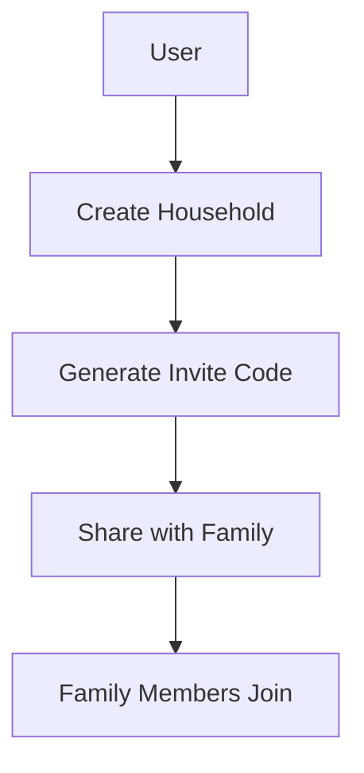

# PetForce Documentation Guide

Comprehensive guide to writing, maintaining, and organizing documentation for PetForce.

## Thomas's Documentation Philosophy

**Core Principles:**

1. **Clear & Concise** - Write for your audience, not yourself
2. **Accurate & Up-to-Date** - Outdated docs are worse than no docs
3. **Discoverable** - If users can't find it, it doesn't exist
4. **Actionable** - Every guide should enable users to accomplish a task
5. **Consistent** - Follow style guides and conventions
6. **Complete** - Cover the happy path AND edge cases
7. **Maintainable** - Structure docs for easy updates

---

## Documentation Types

### 1. Getting Started Guides

**Purpose**: Help new users get up and running quickly

**Structure**:

- Prerequisites
- Installation steps
- First task (e.g., "Create your first household")
- Next steps

**Example**: `docs/GETTING_STARTED.md`

### 2. Tutorials

**Purpose**: Teach concepts through step-by-step instructions

**Structure**:

- What you'll build
- Prerequisites
- Step-by-step instructions
- Expected outcomes
- Troubleshooting

**Example**: `docs/features/*/tutorial.md`

### 3. How-To Guides

**Purpose**: Solve specific problems

**Structure**:

- Problem statement
- Solution steps
- Code examples
- Variations
- Common pitfalls

**Example**: `docs/auth/how-to-*.md`

### 4. Reference Documentation

**Purpose**: Technical specifications and API details

**Structure**:

- Overview
- Parameters/Props
- Return values
- Examples
- Edge cases

**Example**: `docs/API.md`, `docs/api/*.md`

### 5. Conceptual/Explanation Docs

**Purpose**: Explain "why" and "how" systems work

**Structure**:

- Problem/context
- Solution approach
- Architecture diagrams
- Trade-offs
- Related concepts

**Example**: `docs/ARCHITECTURE.md`

---

## Documentation Structure

```
docs/
├── README.md                    # Main documentation index
├── GETTING_STARTED.md          # Onboarding
├── CONTRIBUTING.md             # Contribution guide
├── ARCHITECTURE.md             # System architecture
├── API.md                      # API reference
│
├── auth/                       # Feature-specific docs
│   ├── README.md
│   ├── how-to-setup-supabase.md
│   ├── troubleshooting.md
│   └── api-reference.md
│
├── features/                   # Feature documentation
│   └── feature-name/
│       ├── README.md           # Feature overview
│       ├── tutorial.md         # Step-by-step guide
│       ├── architecture.md     # Technical design
│       └── testing.md          # Test coverage
│
└── [agent-name]/              # Agent-specific docs
    ├── README.md
    └── advanced-patterns.md
```

---

## Writing Style Guide

### Voice & Tone

- **Active voice**: "Click the button" (not "The button should be clicked")
- **Second person**: "You can..." (not "Users can..." or "One can...")
- **Present tense**: "The system validates..." (not "will validate")
- **Conversational but professional**: Friendly, not academic

### Formatting

#### Headings

```markdown
# H1: Page Title (only one per page)

## H2: Major sections

### H3: Subsections

#### H4: Sub-subsections (use sparingly)
```

#### Code Blocks

Always specify language for syntax highlighting:

````markdown
```typescript
function example() {
  return "Use language identifier";
}
```
````

#### Lists

- Use bullets for unordered lists
- Use numbers for sequential steps
- Be consistent with punctuation (all or none)

#### Emphasis

- **Bold** for UI elements and important terms
- _Italic_ for emphasis (use sparingly)
- `Code` for code, file names, commands

### Examples

✅ **Good**:

```markdown
Click the **Create Household** button to get started.
```

❌ **Bad**:

```markdown
To get started, the user should locate and then click on the button
labeled "Create Household" which can be found on the main page.
```

---

## Code Examples

### Best Practices

1. **Keep examples short** - Focus on the concept
2. **Use realistic data** - "John Doe" not "foo"
3. **Show complete examples** - Include imports
4. **Test your examples** - Ensure they actually work
5. **Add comments** - Explain non-obvious parts

### Example Format

```typescript
// Import required modules
import { createHousehold } from "@petforce/auth";

// Create a new household
async function example() {
  const household = await createHousehold({
    name: "The Smith Family",
    description: "Managing our 2 dogs and 1 cat",
  });

  console.log("Created household:", household.id);
  // Output: Created household: hhld_abc123
}
```

---

## Screenshots & Diagrams

### When to Use

- **Screenshots**: UI flows, button locations, visual states
- **Diagrams**: Architecture, data flow, sequence diagrams
- **GIFs/Videos**: Complex interactions, multi-step processes

### Tools

- **Screenshots**: macOS built-in (⌘+Shift+4)
- **Diagrams**: Mermaid (in Markdown), Excalidraw, Figma
- **GIFs**: LICEcap, Kap
- **Screen recording**: QuickTime, Loom

### Mermaid Diagrams



---

## Common Documentation Issues

### Issue 1: Outdated Information

**Problem**: Code changes but docs don't

**Solution**:

- Link docs updates to code changes in PRs
- Regular docs review cycle (quarterly)
- Automated link checking

### Issue 2: Missing Context

**Problem**: Assumes too much knowledge

**Solution**:

- Define terms on first use
- Link to related concepts
- Provide prerequisites section

### Issue 3: Too Much Information

**Problem**: Overwhelming wall of text

**Solution**:

- Break into smaller sections
- Use progressive disclosure (expandable sections)
- Separate reference from tutorials

---

## Documentation Templates

### Feature Documentation Template

```markdown
# Feature Name

Brief description of what this feature does and why it exists.

## Overview

More detailed explanation of the feature, its purpose, and key concepts.

## Quick Start

Minimal example to get users started immediately.

## Installation

Steps to enable/configure the feature.

## Usage

### Basic Example

[Code example]

### Advanced Example

[Code example]

## API Reference

### Function/Component Name

**Parameters**:

- `param1` (type) - Description
- `param2` (type) - Description

**Returns**: Description of return value

**Example**:
[Code example]

## Best Practices

Tips for using the feature effectively.

## Troubleshooting

Common issues and solutions.

## Related Documentation

Links to related features/concepts.
```

---

## Documentation Review Checklist

Before publishing documentation, verify:

### Content

- [ ] Accurate and tested
- [ ] Complete (covers all cases)
- [ ] Clear and concise
- [ ] Free of jargon (or jargon is explained)
- [ ] Examples are realistic and work

### Structure

- [ ] Logical flow
- [ ] Proper heading hierarchy
- [ ] Scannable (bullets, short paragraphs)
- [ ] Table of contents for long docs

### Technical

- [ ] Code examples have syntax highlighting
- [ ] Links are not broken
- [ ] Images load correctly
- [ ] Diagrams are readable

### Style

- [ ] Active voice
- [ ] Present tense
- [ ] Second person ("you")
- [ ] Consistent terminology
- [ ] Follows style guide

---

## Markdown Best Practices

### Links

```markdown
<!-- Relative links for internal docs -->

See [Authentication Guide](./auth/README.md)

<!-- Absolute links for external sites -->

Learn more about [Supabase](https://supabase.com/docs)

<!-- Anchor links for same page -->

Jump to [Installation](#installation)
```

### Tables

```markdown
| Feature | Status  | Notes             |
| ------- | ------- | ----------------- |
| Auth    | ✅ Done | Fully implemented |
| Tasks   | 🚧 WIP  | In progress       |
```

### Admonitions

```markdown
> **Note**: This is an informational note.

> **Warning**: This action cannot be undone.

> **Tip**: Pro tip for advanced users.
```

---

## API Documentation Standards

### Function Documentation

````typescript
/**
 * Creates a new household with the given name and description.
 *
 * @param params - Household creation parameters
 * @param params.name - Display name for the household (3-50 characters)
 * @param params.description - Optional description (max 500 characters)
 * @returns Promise resolving to the created household
 * @throws {ValidationError} If name is invalid
 * @throws {DatabaseError} If creation fails
 *
 * @example
 * ```typescript
 * const household = await createHousehold({
 *   name: 'The Smith Family',
 *   description: 'Managing our pets together'
 * });
 * console.log(household.id); // 'hhld_abc123'
 * ```
 */
export async function createHousehold(
  params: CreateHouseholdParams,
): Promise<Household> {
  // Implementation
}
````

---

## Versioning Documentation

### Version Tags

```markdown
<!-- Indicate version availability -->

> **Since v1.2.0**

<!-- Deprecation warnings -->

> **Deprecated in v2.0.0**: Use `newFunction()` instead.

<!-- Version-specific behavior -->

> **v1.x behavior**: Returns array
> **v2.x behavior**: Returns object
```

---

## Internationalization (i18n)

### Structure for Multiple Languages

```
docs/
├── en/                    # English (default)
│   ├── getting-started.md
│   └── api-reference.md
├── es/                    # Spanish
│   ├── getting-started.md
│   └── api-reference.md
└── fr/                    # French
    ├── getting-started.md
    └── api-reference.md
```

---

## Documentation Metrics

Track documentation health:

- **Coverage**: % of features documented
- **Freshness**: Days since last update
- **Accuracy**: % of broken links
- **Engagement**: Page views, time on page
- **Feedback**: User ratings, issues filed

---

## Resources

### Writing Resources

- [Google Developer Documentation Style Guide](https://developers.google.com/style)
- [Microsoft Writing Style Guide](https://docs.microsoft.com/en-us/style-guide/)
- [Write the Docs](https://www.writethedocs.org/)

### Tools

- [Vale](https://vale.sh/) - Prose linter
- [Markdownlint](https://github.com/DavidAnson/markdownlint) - Markdown linter
- [Mermaid Live Editor](https://mermaid.live/) - Diagram editor

---

Built with clarity by **Thomas (Documentation Agent)** for PetForce.

**Thomas's Motto**: "Good documentation is a love letter to your future self and your users."
