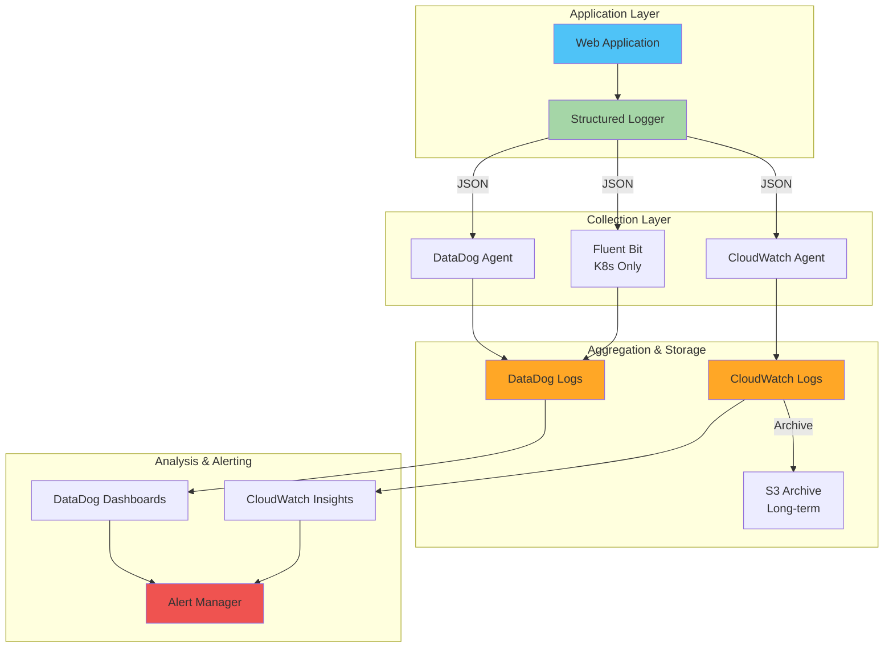
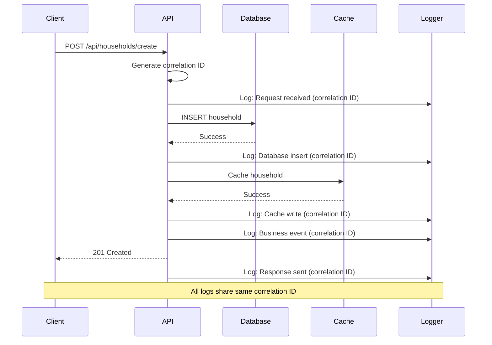

# PetForce Logging & Observability

Comprehensive guide to logging, monitoring, and observability in PetForce.

## Philosophy

**Larry's Logging Principles:**

1. **Log with purpose** - Every log should answer "what happened and why"
2. **Structure everything** - JSON logs for machine parsing
3. **Correlate requests** - Trace user journeys across services
4. **Protect privacy** - Redact PII automatically
5. **Alert on patterns** - Turn logs into actionable insights
6. **Retain intelligently** - Balance cost with compliance

---

## Quick Start

### Basic Structured Logging

```typescript
import { logger } from "@petforce/auth/utils/logger";

// Simple log
logger.info("User created household", {
  userId: user.id,
  householdId: household.id,
  householdName: "[REDACTED]", // PII redacted
});

// With correlation ID (automatic in API routes)
logger.info("Household member added", {
  correlationId: req.correlationId,
  householdId: household.id,
  memberId: member.id,
  role: member.role,
});

// Error logging
logger.error("Failed to create household", {
  error: error.message,
  stack: error.stack,
  userId: user.id,
  input: sanitizeForLogging(input),
});
```

### Log Levels

- **ERROR** - System failures, exceptions, critical issues
- **WARN** - Recoverable issues, deprecation warnings, unusual patterns
- **INFO** - Business events, state changes, key operations
- **DEBUG** - Detailed flow, variable values (development only)

---

## Documentation Structure

### Core Guides

1. [Structured Logging Guide](./structured-logging.md)
   - Log format standards
   - Correlation IDs
   - Context propagation
   - TypeScript types

2. [Business Event Logging](./business-events.md)
   - Household events
   - Authentication events
   - User events
   - Event schemas

3. [PII Protection](./pii-redaction.md)
   - What is PII
   - Automatic redaction
   - Redaction utilities
   - Compliance (GDPR, CCPA)

4. [Error Logging](./error-logging.md)
   - Error categorization
   - Stack traces
   - Error context
   - Error aggregation

5. [Performance Logging](./performance-logging.md)
   - Slow operation detection
   - Query performance
   - API latency tracking
   - Performance budgets

6. [Audit Logging](./audit-logging.md)
   - Security events
   - Admin actions
   - Data access logs
   - Compliance requirements

### Platform Guides

7. [DataDog Integration](./datadog.md)
   - Setup and configuration
   - Log pipelines
   - Custom metrics
   - Dashboards and alerts

8. [CloudWatch Integration](./cloudwatch.md)
   - Log groups and streams
   - Log Insights queries
   - Metric filters
   - Alarms

9. [Prometheus Metrics](./prometheus.md)
   - Metric types
   - Custom metrics
   - Service monitoring
   - Grafana dashboards

### Best Practices

10. [Log Retention Policies](./retention.md)
    - Retention periods by environment
    - Cost optimization
    - Compliance requirements
    - Archive strategies

11. [Log Analysis](./log-analysis.md)
    - Common queries
    - Troubleshooting patterns
    - Log-based debugging
    - Performance analysis

12. [Alerting Best Practices](./alerting.md)
    - Alert design
    - Alert fatigue prevention
    - Escalation policies
    - Runbook integration

---

## Log Architecture



---

## Log Flow Example

### 1. User Creates Household

```typescript
// API Request: POST /api/households/create
// Correlation ID: req-abc123

// Step 1: Request received
logger.info("API request received", {
  correlationId: "req-abc123",
  method: "POST",
  path: "/api/households/create",
  userId: "user-456",
  userAgent: "Mozilla/5.0...",
  ip: "192.168.1.1", // Anonymized
});

// Step 2: Validation
logger.debug("Validating household input", {
  correlationId: "req-abc123",
  userId: "user-456",
  nameLength: 15,
});

// Step 3: Database operation
logger.info("Creating household in database", {
  correlationId: "req-abc123",
  userId: "user-456",
  operation: "INSERT",
  table: "households",
});

// Step 4: Business event
logger.info("Household created successfully", {
  correlationId: "req-abc123",
  event: "household.created",
  userId: "user-456",
  householdId: "household-789",
  householdName: "[REDACTED]",
  memberCount: 1,
  duration_ms: 150,
});

// Step 5: Cache operation
logger.debug("Caching household data", {
  correlationId: "req-abc123",
  householdId: "household-789",
  ttl_seconds: 300,
});

// Step 6: Response sent
logger.info("API response sent", {
  correlationId: "req-abc123",
  statusCode: 201,
  duration_ms: 150,
});
```

### Log Query in DataDog

```
correlationId:req-abc123
```

**Result**: Complete trace of the request from start to finish

---

## Correlation ID Flow



---

## PII Protection Example

```typescript
// Before logging
const input = {
  name: "The Zeder House",
  description: "My family home",
  ownerEmail: "daniel@example.com",
  ownerPhone: "+1-555-123-4567",
};

// Auto-redact PII
const safeInput = sanitizeForLogging(input);
// {
//   name: '[REDACTED]',
//   description: '[REDACTED]',
//   ownerEmail: '[REDACTED]',
//   ownerPhone: '[REDACTED]',
// }

logger.info("Creating household", {
  userId: user.id, // OK - not PII
  input: safeInput, // Redacted
});
```

**PII Fields Auto-Redacted**:

- Names (household names, user names)
- Email addresses
- Phone numbers
- Addresses
- IP addresses (anonymized to /24)
- User-generated content

---

## Error Tracking Example

```typescript
try {
  await createHousehold(input);
} catch (error) {
  // Categorize error
  const category = categorizeError(error);

  logger.error("Household creation failed", {
    correlationId: req.correlationId,
    errorCategory: category, // 'database', 'validation', 'auth', etc.
    errorCode: error.code,
    errorMessage: error.message,
    stack: error.stack,
    userId: user.id,
    input: sanitizeForLogging(input),
    retryable: isRetryableError(error),
  });

  // Increment error counter for alerting
  metrics.increment("household.create.error", {
    category,
    code: error.code,
  });
}
```

---

## Performance Logging Example

```typescript
import { measurePerformance } from "@petforce/auth/utils/performance";

// Automatic timing
const result = await measurePerformance(
  "household.create",
  () => createHouseholdInDatabase(input),
  {
    correlationId: req.correlationId,
    userId: user.id,
  },
);

// Logs:
// {
//   event: 'household.create',
//   duration_ms: 150,
//   status: 'success',
//   correlationId: 'req-abc123',
//   userId: 'user-456',
// }

// Alerts if duration > 1000ms
```

---

## Log Retention Strategy

| Environment | Hot Storage | Warm Storage | Cold Archive | Total Retention |
| ----------- | ----------- | ------------ | ------------ | --------------- |
| Production  | 7 days      | 30 days      | 365 days     | 1 year          |
| Staging     | 3 days      | 7 days       | 90 days      | 3 months        |
| Development | 1 day       | -            | -            | 1 day           |

**Hot Storage**: Immediate access, full-text search (DataDog, CloudWatch)  
**Warm Storage**: Slower access, query-based (CloudWatch Insights, S3 Select)  
**Cold Archive**: Rare access, compliance only (S3 Glacier)

**Cost Estimate**:

- Hot: $0.50/GB/month (DataDog)
- Warm: $0.03/GB/month (CloudWatch)
- Cold: $0.004/GB/month (S3 Glacier)

---

## Common Log Queries

### Find All Errors for a User

```
userId:user-456 status:error
```

### Trace a Request

```
correlationId:req-abc123
```

### Find Slow Operations

```
event:household.* duration_ms:>1000
```

### Household Creation Failures

```
event:household.created status:error
```

### Authentication Failures

```
event:auth.login.failed
```

### Database Errors

```
errorCategory:database
```

---

## Monitoring Dashboards

### Application Health Dashboard

**Widgets**:

1. Error rate (last 1 hour)
2. P95 latency by endpoint
3. Request throughput
4. Error breakdown by category
5. Top 10 errors by count

### Household Operations Dashboard

**Widgets**:

1. Household creation rate
2. Household join success rate
3. Invite code regeneration rate
4. Member addition/removal rate
5. Leadership transfer rate

### Performance Dashboard

**Widgets**:

1. Slow operations (>1s)
2. Database query performance
3. Redis cache hit rate
4. API endpoint latency distribution
5. Request duration heatmap

---

## Alerting Examples

### Critical Alerts (Page Immediately)

1. **Error Rate Spike**
   - Trigger: Error rate > 10 errors/sec for 5 minutes
   - Action: Page on-call engineer

2. **Database Connection Failures**
   - Trigger: `errorCategory:database` > 5/minute
   - Action: Page database on-call

3. **Authentication Service Down**
   - Trigger: `event:auth.login.failed` > 20/minute
   - Action: Page security team

### Warning Alerts (Slack Notification)

1. **Slow Operations**
   - Trigger: Operations > 2s count > 10/minute
   - Action: Notify platform team

2. **High Error Rate on Specific Endpoint**
   - Trigger: Endpoint errors > 5/minute
   - Action: Notify team owning endpoint

---

## Getting Started

### For Developers

1. Read [Structured Logging Guide](./structured-logging.md)
2. Review [Business Event Logging](./business-events.md)
3. Use PII redaction utilities from [PII Protection](./pii-redaction.md)
4. Follow patterns in existing code

### For SREs

1. Set up [DataDog Integration](./datadog.md)
2. Configure [Log Retention](./retention.md)
3. Create dashboards from [Log Analysis](./log-analysis.md)
4. Set up alerts from [Alerting Best Practices](./alerting.md)

### For Product/Analytics

1. Review [Business Event Logging](./business-events.md)
2. Query logs using [Log Analysis](./log-analysis.md)
3. Create reports from aggregated events

---

## Compliance & Security

### GDPR Compliance

- ✅ PII automatically redacted in logs
- ✅ User data deleted from logs on user deletion
- ✅ Data access logged for auditing
- ✅ Data retention policies enforced

### CCPA Compliance

- ✅ User data identified and tracked
- ✅ Deletion requests handled
- ✅ Third-party sharing logged

### Security

- ✅ No passwords or tokens in logs
- ✅ Admin actions audited
- ✅ Unauthorized access attempts logged
- ✅ Security incidents tracked

---

## Resources

- [DataDog Documentation](https://docs.datadoghq.com/)
- [CloudWatch Logs Documentation](https://docs.aws.amazon.com/cloudwatch/)
- [Prometheus Best Practices](https://prometheus.io/docs/practices/)
- [Structured Logging Best Practices](https://www.datadoghq.com/blog/structured-logging/)

---

Built with ❤️ by Larry (Logging & Observability Agent)

**Larry's Motto**: "If it's not logged, it didn't happen. If it's not monitored, it will fail."
