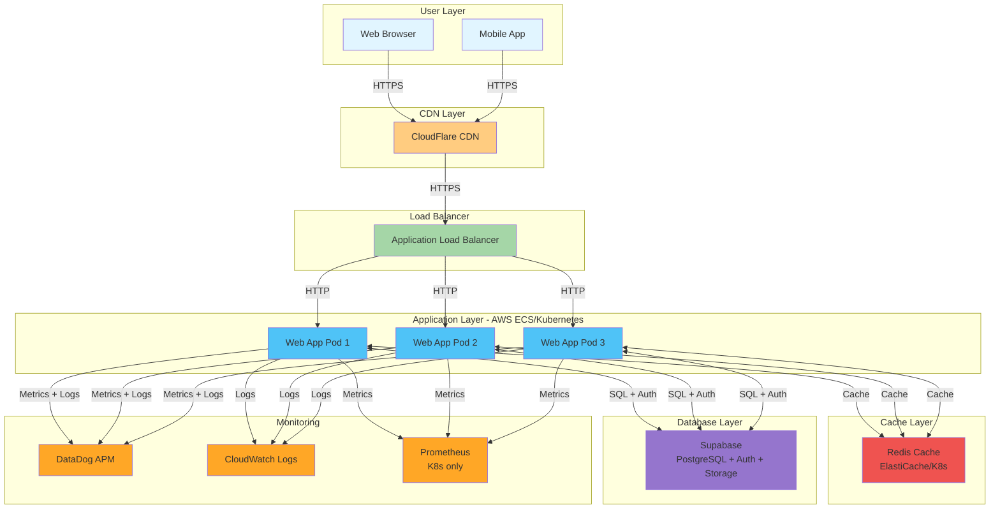
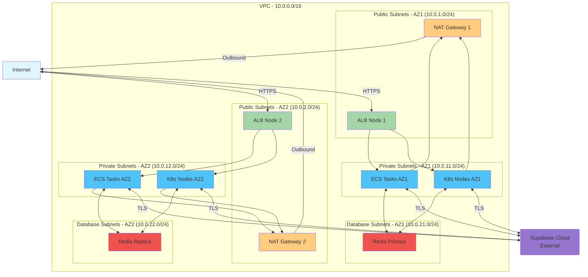
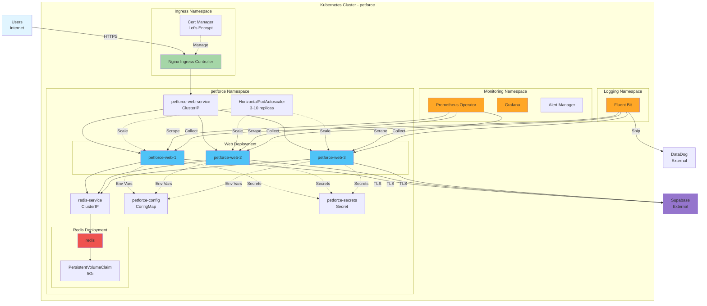
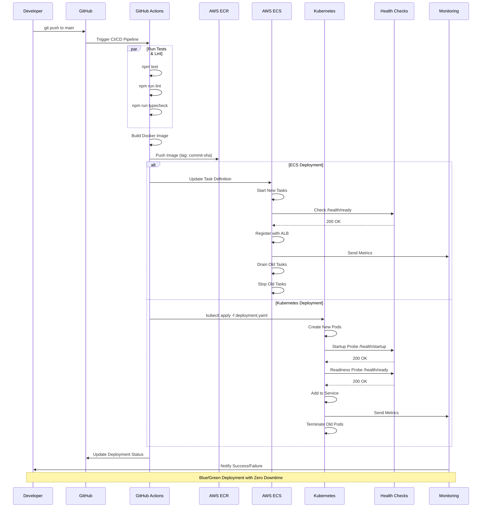
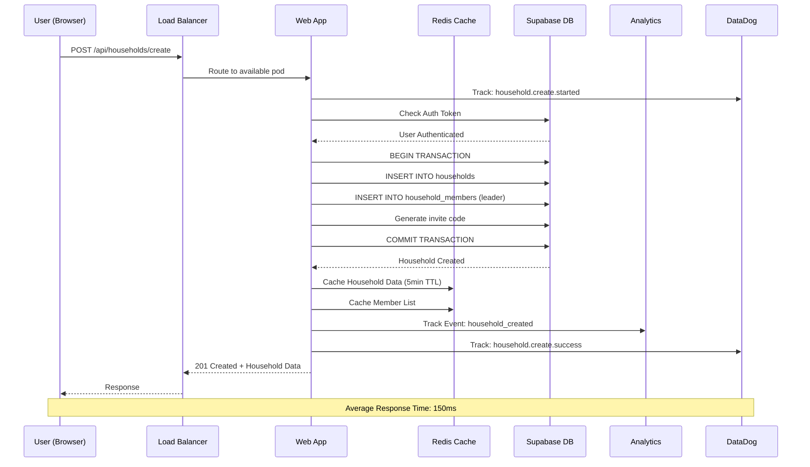
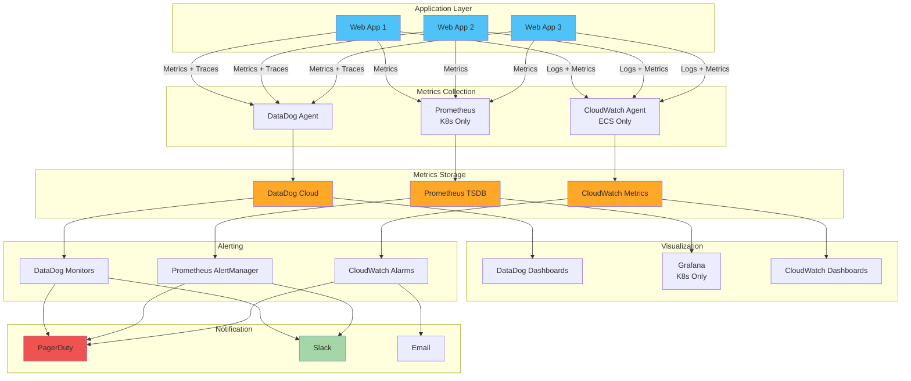
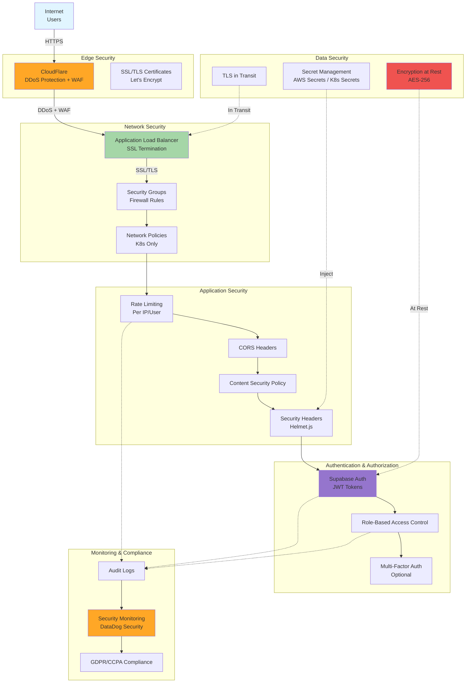
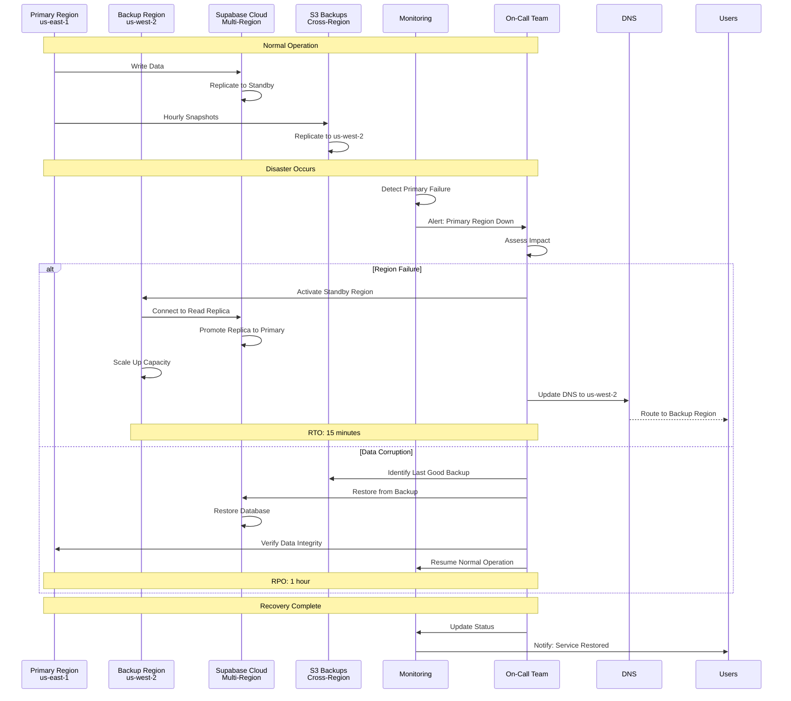
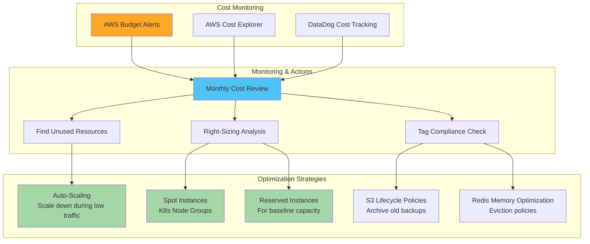

# PetForce Infrastructure Diagrams

Visual documentation of PetForce's infrastructure architecture, deployment flows, and data flows.

---

## Table of Contents

1. [High-Level Architecture](#high-level-architecture)
2. [Network Architecture](#network-architecture)
3. [Kubernetes Architecture](#kubernetes-architecture)
4. [Deployment Flow](#deployment-flow)
5. [Data Flow](#data-flow)
6. [Monitoring Architecture](#monitoring-architecture)
7. [Security Architecture](#security-architecture)
8. [Disaster Recovery Flow](#disaster-recovery-flow)

---

## High-Level Architecture

---

## Network Architecture

---

## Kubernetes Architecture

---

## Deployment Flow

---

## Data Flow - Household Creation

---

## Monitoring Architecture

---

## Security Architecture

---

## Disaster Recovery Flow

---

## Cost Optimization Flow

---

## Legend

### Node Colors

- 🟦 **Blue (#4fc3f7)**: Application/Service Nodes
- 🟩 **Green (#a5d6a7)**: Load Balancers/Routing
- 🟥 **Red (#ef5350)**: Cache/Database
- 🟪 **Purple (#9575cd)**: External Services
- 🟧 **Orange (#ffa726)**: Monitoring/Observability
- 🟨 **Yellow (#ffcc80)**: CDN/Edge Services
- 🔵 **Light Blue (#e1f5ff)**: Users/Clients

### Arrow Types

- **Solid Arrow (→)**: Data/Request Flow
- **Dashed Arrow (-.->)**: Configuration/Dependency
- **Bold Arrow (==>)**: High-Traffic Path

---

## Diagram Tools

These diagrams are created using [Mermaid](https://mermaid-js.github.io/), which is supported natively in:

- GitHub Markdown
- GitLab Markdown
- VS Code (with Mermaid extension)
- Many documentation platforms

To edit diagrams:

1. Copy the Mermaid code
2. Paste into [Mermaid Live Editor](https://mermaid.live/)
3. Edit and export as needed

---

## Related Documentation

- [Deployment Guide](./deploy.md)
- [Kubernetes Configuration](./kubernetes/deployment.yaml)
- [Monitoring & Alerting](./monitoring/alerts.yaml)
- [Health Checks](./health-checks.md)

---

Built with ❤️ by the PetForce Infrastructure Team
