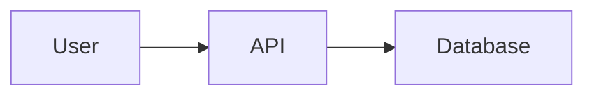

# Documentation Style Guide

> The authoritative reference for writing consistent, clear, and helpful documentation.

**Maintained by**: Thomas (Documentation Guardian)  
**Last Updated**: {{DATE}}

---

## Table of Contents

1. [Voice & Tone](#voice--tone)
2. [Writing Guidelines](#writing-guidelines)
3. [Formatting Standards](#formatting-standards)
4. [Terminology](#terminology)
5. [Code Examples](#code-examples)
6. [Images & Media](#images--media)
7. [Links & References](#links--references)
8. [Document Types](#document-types)

---

## Voice & Tone

### Our Voice

Our documentation voice is:

| Characteristic | Description | Example |
|----------------|-------------|---------|
| **Clear** | Direct and unambiguous | "Click **Save**" not "You might want to click the Save button" |
| **Helpful** | Focused on user success | Lead with what they can do, not limitations |
| **Professional** | Respectful and trustworthy | No slang, consistent quality |
| **Friendly** | Approachable, not robotic | Conversational but not casual |

### Tone Adjustments

Adjust tone based on context:

| Context | Tone | Example |
|---------|------|---------|
| Getting started | Encouraging, welcoming | "You're ready to create your first project!" |
| Reference docs | Precise, efficient | "Returns: `string` - The user's display name" |
| Troubleshooting | Calm, supportive | "This error usually means..." |
| Error messages | Clear, actionable | "Invalid API key. Generate a new key in Settings > API." |

### What to Avoid

| ❌ Avoid | ✅ Use Instead | Why |
|----------|----------------|-----|
| "Simply do X" | "Do X" | "Simply" implies it's easy; may frustrate |
| "Obviously" | Remove entirely | Condescending |
| "Just" | State directly | Minimizes complexity |
| "Please note that" | Use a Note callout | Verbose |
| "In order to" | "To" | Verbose |
| "It should be noted" | State directly | Passive and weak |
| "Actually" | Remove | Often unnecessary |
| "Basically" | Remove | Vague filler word |

---

## Writing Guidelines

### Sentence Structure

1. **One idea per sentence**
   - ❌ "Click the button and then enter your name in the field that appears, making sure to use your legal name as it appears on your ID."
   - ✅ "Click the button. Enter your legal name in the field."

2. **Keep sentences short** (15-25 words max)
   - ❌ "The configuration file, which is located in the root directory of your project and controls various aspects of the application's behavior, must be edited to enable this feature."
   - ✅ "Edit the configuration file in your project's root directory to enable this feature."

3. **Lead with the action**
   - ❌ "To create a new project, click the **New** button."
   - ✅ "Click **New** to create a project."

4. **Use active voice**
   - ❌ "The file is saved by the system automatically."
   - ✅ "The system saves the file automatically."

5. **Use present tense**
   - ❌ "The system will display a confirmation."
   - ✅ "The system displays a confirmation."

6. **Address the reader as "you"**
   - ❌ "Users can configure their settings..."
   - ✅ "You can configure your settings..."

### Paragraphs

- **Keep paragraphs short**: 3-4 sentences maximum
- **One topic per paragraph**: If you change topics, start a new paragraph
- **Lead with the main point**: Don't bury the key information

### Instructions & Procedures

Write numbered steps for sequential actions:

```markdown
1. Navigate to **Settings** > **API Keys**.
2. Click **Generate New Key**.
3. Enter a name for your key.
4. Click **Create**.

Your new API key appears. Copy it now—you won't see it again.
```

**Rules for steps:**
- Start each step with an action verb
- One action per step (unless tightly coupled)
- Include expected results after significant steps
- Use **bold** for UI elements

---

## Formatting Standards

### Headings

```markdown
# Page Title (H1)
Only one H1 per page.

## Major Section (H2)
Main content sections.

### Subsection (H3)
Breaking down major sections.

#### Minor Section (H4)
Use sparingly. Consider if you need this depth.
```

**Heading rules:**
- Use sentence case: "Getting started with authentication"
- Don't skip levels (H2 → H4 is wrong)
- Make headings descriptive and scannable
- Avoid questions as headings unless in FAQ
- Don't end headings with punctuation

### Text Formatting

| Format | Usage | Example |
|--------|-------|---------|
| **Bold** | UI elements, emphasis | Click **Save** |
| *Italic* | Introducing terms, titles | This is called *idempotency* |
| `Code` | Code, commands, file names | Run `npm install` |
| "Quotes" | User input, exact text | Enter "admin" |

### Lists

**Use numbered lists for:**
- Sequential steps
- Ranked items
- Items that will be referenced by number

**Use bulleted lists for:**
- Non-sequential items
- Features or characteristics
- Options without priority

**List formatting:**
- Keep items parallel in structure
- Use consistent punctuation
- Limit to 7-9 items; group if more needed
- Minimum 2 items in any list

```markdown
✅ Good (parallel structure):
- Create projects
- Edit settings
- Invite team members

❌ Bad (not parallel):
- Creating projects
- You can edit settings
- Team member invitation
```

### Callouts

Use callouts for important information:

```markdown
> **Note**: Supplementary information that's helpful but not critical.

> **Tip**: Best practices or shortcuts to improve the user's experience.

> **Important**: Information the user must know to succeed.

> **Warning**: Potential issues, data loss, or irreversible actions.

> **Caution**: Security-related warnings.
```

### Tables

Use tables for:
- Comparing options
- Parameter references
- Structured data

```markdown
| Parameter | Type | Required | Description |
|-----------|------|----------|-------------|
| `name` | string | Yes | Display name |
| `email` | string | Yes | User email |
| `role` | string | No | Default: `member` |
```

**Table rules:**
- Always include a header row
- Align text left, numbers right
- Keep cells concise
- Use code formatting for technical values

---

## Terminology

### Approved Terms

Use consistent terminology across all documentation:

| ✅ Use | ❌ Don't Use | Notes |
|--------|--------------|-------|
| sign in | log in, login | "login" only as noun/adjective |
| sign out | log out, logout | "logout" only as noun/adjective |
| set up | setup | "setup" only as noun/adjective |
| email | e-mail | No hyphen |
| API key | api key, APIKey | Capitalize API, lowercase key |
| ID | id, Id | Always uppercase |
| URL | url, Url | Always uppercase |
| OK | Ok, okay | All uppercase |
| click | click on | Just "click" |
| select | choose, pick | For choosing from options |
| enter | type, input | For text fields |
| app | application | Unless formal context |
| info | information | In UI; "information" in docs |

### Product Terminology

Define and use product-specific terms consistently:

```markdown
**Workspace**: A container for projects and team members.
**Project**: A collection of related resources within a workspace.
**Resource**: An individual item (file, task, etc.) within a project.
```

### Abbreviations & Acronyms

- Spell out on first use: "Application Programming Interface (API)"
- After first use, use abbreviation: "API"
- Common terms (URL, HTML, CSS) don't need spelling out
- Add to glossary for reference

---

## Code Examples

### Code Blocks

Always specify the language:

````markdown
```javascript
const result = await client.getData();
```
````

### Code Guidelines

1. **Test all code examples** - They must work
2. **Use realistic examples** - Avoid `foo`, `bar`, `test`
3. **Include necessary context** - Imports, setup
4. **Comment complex parts** - But don't over-comment
5. **Show expected output** when helpful

```javascript
// Good example
const user = await client.users.get('user_123');
console.log(user.name);
// Output: "Jane Doe"
```

### Inline Code

Use for:
- File names: `config.yaml`
- Commands: `npm install`
- Code elements: `userId`, `true`, `null`
- Paths: `/home/user/documents`
- Keys: Press `Enter`

Don't use for:
- UI elements (use **bold**)
- Emphasis (use *italic* or **bold**)
- Product names

### Placeholder Text

Use clear, descriptive placeholders:

| ✅ Use | ❌ Don't Use |
|--------|--------------|
| `YOUR_API_KEY` | `xxx`, `abc123` |
| `your-project-name` | `foo`, `test` |
| `user@example.com` | `a@b.c` |

Format placeholders in `SCREAMING_SNAKE_CASE` or `kebab-case` to stand out.

---

## Images & Media

### Screenshots

- **Crop to relevant area** - Don't show entire screen if unnecessary
- **Highlight important elements** - Use arrows or boxes
- **Use consistent styling** - Same highlight color, arrow style
- **Keep images current** - Update when UI changes
- **Add alt text** - Describe what the image shows

```markdown

```

### Diagrams

Use diagrams for:
- Architecture overviews
- Workflows and processes
- Data flows
- Relationships between components

Tools: Mermaid (in-doc), Excalidraw, Figma

```markdown

```

### Image Guidelines

| Guideline | Standard |
|-----------|----------|
| Format | PNG for screenshots, SVG for diagrams |
| Max width | 800px (retina: 1600px) |
| File size | < 500KB |
| Naming | `section-description.png` |
| Location | `./images/` relative to doc |

---

## Links & References

### Link Text

Use descriptive link text:

| ❌ Avoid | ✅ Use |
|----------|--------|
| Click [here](link) | See the [installation guide](link) |
| [Link](link) | Read about [authentication](link) |
| More info [here](link) | Learn about [API limits](link) |

### Internal Links

- Use relative paths: `./feature.md`, `../reference/api.md`
- Link to specific sections: `./feature.md#configuration`
- Verify links work (automated checking)

### External Links

- Open in new tab when appropriate
- Verify links periodically
- Note when linking to third-party content

### Cross-References

```markdown
For more information, see:
- [Getting Started Guide](../getting-started/introduction.md)
- [API Reference](../reference/api/overview.md)
- [Troubleshooting](../troubleshooting/common-issues.md)
```

---

## Document Types

### Getting Started / Tutorials

**Purpose**: Help users learn by doing

**Structure**:
1. Introduction (what they'll accomplish)
2. Prerequisites
3. Step-by-step instructions
4. Verification / next steps

**Style**: Encouraging, supportive, explain "why"

### How-To Guides

**Purpose**: Help users accomplish specific tasks

**Structure**:
1. Brief overview
2. Prerequisites
3. Steps (numbered)
4. Verification

**Style**: Direct, efficient, action-oriented

### Reference Documentation

**Purpose**: Provide comprehensive technical details

**Structure**:
- Organized by topic/component
- Complete parameter descriptions
- Examples for each feature

**Style**: Precise, complete, consistent format

### Conceptual / Explanation

**Purpose**: Help users understand how things work

**Structure**:
- Background/context
- Core concepts
- How it works
- When to use

**Style**: Educational, thorough, use analogies

### Troubleshooting

**Purpose**: Help users solve problems

**Structure**:
- Symptom-based organization
- Cause identification
- Step-by-step solutions

**Style**: Calm, supportive, actionable

---

## Quick Reference

### Before You Publish

- [ ] Spellcheck complete
- [ ] Code examples tested
- [ ] Links verified
- [ ] Screenshots current
- [ ] Reviewed by peer
- [ ] Follows this style guide

### Common Mistakes

| Mistake | Fix |
|---------|-----|
| Passive voice | Use active voice |
| Long sentences | Break into shorter ones |
| Jargon without explanation | Define terms or link to glossary |
| Steps without results | Add expected outcomes |
| Missing prerequisites | Add prerequisites section |
| Outdated screenshots | Update or remove |

---

*This style guide is maintained by Thomas. Suggest improvements via PR or discussion.*
